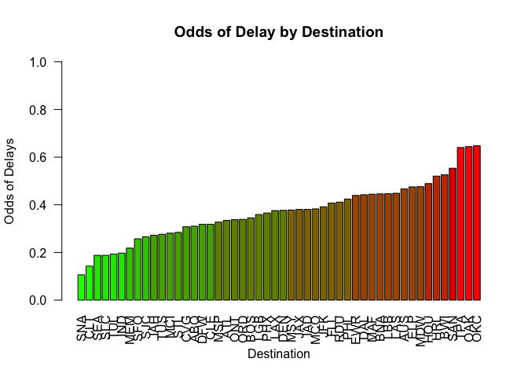
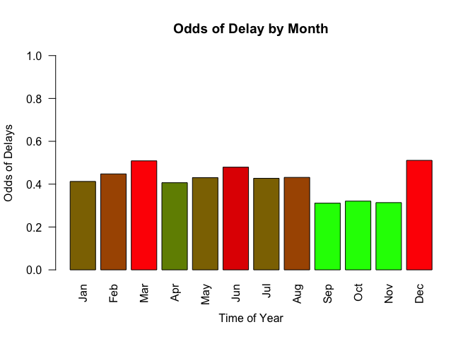
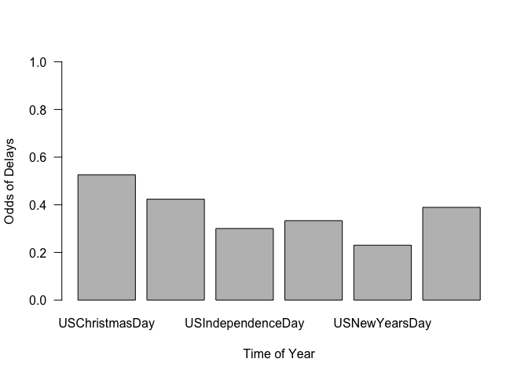
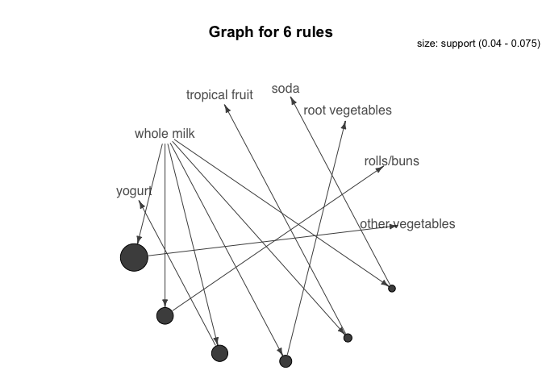

STA 380 Homework 2: Arjun Adapalli, Tomas Fernandez, Rajat Malhotra
================
Arjun Adapalli, Tomas Fernandez, Rajat Malhotra
8/18/2017

#### Importing Libraries

``` r
library(tm)
```

    ## Loading required package: NLP

``` r
library(magrittr)
library(randomForest)
```

    ## randomForest 4.6-12

    ## Type rfNews() to see new features/changes/bug fixes.

Problem 1: Flights at ABIA
==========================

#### For this problem, our group created visuals that presented the odds of departure delay based on various features.

##### Couple of things to note:

###### We included all departure delays (any flight that had a positive value under the 'DepDelay' column) in our plots

###### We calculated the "Odds of Delay" by dividing the number of delayed flights (those that met the condition specified above) of a given category by the total number of flights of that category.

### Relative Odds of Delay for various Airlines flying from Austin


#### Below is the code for the above wordcloud. Creating it involved editing the dataset excel file directly, thus the code will not work without the edited excel file.

``` r
# Code for above wordcloud. Creating it involved editing the dataset excel file directly, thus the code will not work without the edited excel file.
#library(wordcloud)
#library(SnowballC)
#library(RColorBrewer)

#airlineQ <- read.csv('ABIA.csv', stringsAsFactors = FALSE)

#airlineQP <- airlineQ[airlineQ$DepDelay>0,]

#airlineCorpus <- Corpus(VectorSource(airlineQP$UniqueCarrier))

#dtm <- DocumentTermMatrix(airlineCorpus)

#m <- as.matrix(dtm)

#v <- sort(colSums(m),decreasing=TRUE)

#head(v,16)

#words <- names(v)

#d <- data.frame(word=words, freq=v)

#set.seed(123)

#wordcloud(words = d$word, freq = d$freq, min.freq = 1,
#          max.words=200, random.order=FALSE, rot.per=0.35, 
#          colors=brewer.pal(4, "Dark2"))

#airlineQQ <- airlineQ[airlineQ$ArrDelay>0,]

#airlineCorpus2 <- Corpus(VectorSource(airlineQQ$UniqueCarrier))

#dtm2 <- DocumentTermMatrix(airlineCorpus2)

#m2 <- as.matrix(dtm2)

#v2 <- sort(colSums(m2),decreasing=TRUE)

#head(v2,16)

#words <- names(v2)

#d2 <- data.frame(word=words, freq=v2)

#set.seed(123)

#wordcloud(words = d2$word,scale=c(4,0.5), freq = d2$freq, min.freq = 1,
#          max.words=20, random.order=FALSE, rot.per=0.35, 
#          colors=brewer.pal(4, "Set1"))
```

### Odds of Delay for various flight destinations

``` r
df<-read.csv("ABIA.csv")

unique(df$Dest)
```

    ##  [1] AUS ORD PHX MEM DFW MSP IAH JFK MSY TUS MDW SFO SNA ONT SLC DEN ATL
    ## [18] LAX LAS SAN ABQ BWI MCI CVG DAL HOU CLE IAD RDU EWR ELP HRL MCO BOS
    ## [35] OKC TUL TPA SJC MAF STL LBB BNA JAX PHL ORF DSM SEA FLL LGB IND CLT
    ## [52] OAK DTW
    ## 53 Levels: ABQ ATL AUS BNA BOS BWI CLE CLT CVG DAL DEN DFW DSM DTW ... TUS

``` r
### Odds by Destination

# Creating DataFrame of Destination
odds_df<-data.frame(unique(df$Dest),0,0,0)
colnames(odds_df)<-c("Destination","Number of Flights","Number of Delays","Odds of Delay")

for (dest in odds_df$Destination){
  
  odds_df[odds_df$Destination==dest,"Number of Flights"]<-nrow(df[df$Dest==dest,])
  odds_df[odds_df$Destination==dest,"Number of Delays"]<-nrow(df[(df$Dest==dest) & (df$DepDelay>0),])
  odds_df$`Odds of Delay`<-odds_df$`Number of Delays`/odds_df$`Number of Flights`
}
## Filter out destinations with few records:
odds_df<-odds_df[odds_df[,"Number of Flights"]>20,]
## Order
odds_df<-odds_df[order(odds_df$`Odds of Delay`,decreasing = FALSE),]

rbpal<-colorRampPalette(c('green','red'))
odds_df$Col<-rbpal(10)[as.numeric(cut(odds_df$`Odds of Delay`,breaks=10))]

barplot(odds_df$`Odds of Delay`,names.arg = odds_df$Destination,las=2,ylim = c(0,1),col = odds_df$Col,xlab = "Destination",ylab = "Odds of Delays",main = "Odds of Delay by Destination")
```



### Odds of Delay by Time of Year (in Months)

``` r
# DataFrame of Time of Year
odds_df_year<-data.frame(unique(df$Month),0,0,0)
colnames(odds_df_year)<-c("Time of Year","Number of Flights","Number of Delays","Odds of Delay")

for (month in odds_df_year$`Time of Year`){
  
  odds_df_year[odds_df_year$`Time of Year`==month,"Number of Flights"]<-nrow(df[df$Month==month,])
  odds_df_year[odds_df_year$`Time of Year`==month,"Number of Delays"]<-nrow(df[(df$Month==month) & (df$DepDelay>0),])
  odds_df_year$`Odds of Delay`<-odds_df_year$`Number of Delays`/odds_df_year$`Number of Flights`
}


rbpal<-colorRampPalette(c('green','red'))
odds_df_year$Col<-rbpal(10)[as.numeric(cut(odds_df_year$`Odds of Delay`,breaks=10))]
monthNames = c('Jan','Feb','Mar','Apr','May','Jun','Jul','Aug','Sep','Oct','Nov','Dec')

barplot(odds_df_year$`Odds of Delay`,names.arg = monthNames,las=2,ylim = c(0,1),col = odds_df_year$Col,xlab = "Time of Year",ylab = "Odds of Delays",main = "Odds of Delay by Month")
```



``` r
df$date<-paste(df$Month,"/",df$DayofMonth,"/",df$Year,sep="")


# DataFrame of Destination, Destination Number of Flights, Destination Number of Delays, Odds of Delay
odds_df_date<-data.frame(unique(df$date),0,0,0)
colnames(odds_df_date)<-c("Time of Year","Number of Flights","Number of Delays","Odds of Delay")

for(date in unique(df$date)){
  odds_df_date[odds_df_date$`Time of Year`==date,"Number of Flights"]<-nrow(df[df$date==date,])
  odds_df_date[odds_df_date$`Time of Year`==date,"Number of Delays"]<-nrow(df[(df$date==date) & (df$DepDelay>0),])
  odds_df_date$`Odds of Delay`<-odds_df_date$`Number of Delays`/odds_df_date$`Number of Flights`
}
```

####### 

### Odds of Delay in specific holidays

``` r
library(timeDate)
library(chron)

hlist <- c("USChristmasDay","USGoodFriday","USIndependenceDay","USLaborDay",
           "USNewYearsDay","USThanksgivingDay")        
myholidays  <- dates(as.character(holiday(2000:2013,hlist)),format="Y-M-D")
holiday_odds<-odds_df_date[is.holiday(odds_df_date$`Time of Year`,myholidays),]

barplot(holiday_odds$`Odds of Delay`,names.arg = hlist,las=1,ylim = c(0,1),col = holiday_odds$Col,xlab = "Time of Year",ylab = "Odds of Delays")
```



Problem 2: Author Attribution
=============================

### Loading/Processing the Training Data

``` r
## "readerPlain" wraps another function around readPlain to read
## plain text documents in English.
readerPlain = function(fname){
  readPlain(elem=list(content=readLines(fname)), 
            id=fname, language='en') }

## Rolling two directories together into a single corpus
## TRAIN
author_dirs = Sys.glob('ReutersC50/C50train/*')
file_list = NULL
labels = NULL
for(author in author_dirs) {
  author_name = substring(author, first=21)
  files_to_add = Sys.glob(paste0(author, '/*.txt'))
  file_list = append(file_list, files_to_add)
  labels = append(labels, rep(author_name, length(files_to_add)))
}


# Need a more clever regex to get better names here
all_docs = lapply(file_list, readerPlain) 
names(all_docs) = file_list
names(all_docs) = sub('.txt', '', names(all_docs))

my_corpus = Corpus(VectorSource(all_docs))

# Preprocessing
my_corpus = tm_map(my_corpus, content_transformer(tolower)) # make everything lowercase
my_corpus = tm_map(my_corpus, content_transformer(removeNumbers)) # remove numbers
my_corpus = tm_map(my_corpus, content_transformer(removePunctuation)) # remove punctuation
my_corpus = tm_map(my_corpus, content_transformer(stripWhitespace)) ## remove excess white-space
my_corpus = tm_map(my_corpus, content_transformer(removeWords), stopwords("SMART"))

#creation of Document Term Matrix
DTM = DocumentTermMatrix(my_corpus)
DTM
```

    ## <<DocumentTermMatrix (documents: 2500, terms: 32241)>>
    ## Non-/sparse entries: 473695/80128805
    ## Sparsity           : 99%
    ## Maximal term length: 40
    ## Weighting          : term frequency (tf)

``` r
highestfreq<-findFreqTerms(DTM,100)
DTM = DocumentTermMatrix(my_corpus,control=list(dictionary=highestfreq))
DTM # some basic summary statistics
```

    ## <<DocumentTermMatrix (documents: 2500, terms: 1238)>>
    ## Non-/sparse entries: 275144/2819856
    ## Sparsity           : 91%
    ## Maximal term length: 18
    ## Weighting          : term frequency (tf)

``` r
# Now a dense matrix
X = as.matrix(DTM)
row.names(X)=file_list
```

### Loading/Processing the Test Data

``` r
author_dirs_test = Sys.glob('ReutersC50/C50test/*')
file_list_test = NULL
labels_test = NULL
for(author in author_dirs_test) {
  author_name_test = substring(author, first=20)
  files_to_add_test = Sys.glob(paste0(author, '/*.txt'))
  file_list_test = append(file_list_test, files_to_add_test)
  labels_test = append(labels_test, rep(author_name_test, length(files_to_add_test)))
}


# Need a more clever regex to get better names here
all_docs_test = lapply(file_list_test, readerPlain) 
names(all_docs_test) = file_list_test
names(all_docs_test) = sub('.txt', '', names(all_docs_test))

my_corpus_test = Corpus(VectorSource(all_docs_test))

# Preprocessing
my_corpus_test = tm_map(my_corpus_test, content_transformer(tolower)) # make everything lowercase
my_corpus_test = tm_map(my_corpus_test, content_transformer(removeNumbers)) # remove numbers
my_corpus_test = tm_map(my_corpus_test, content_transformer(removePunctuation)) # remove punctuation
my_corpus_test = tm_map(my_corpus_test, content_transformer(stripWhitespace)) ## remove excess white-space
my_corpus_test = tm_map(my_corpus_test, content_transformer(removeWords), stopwords("SMART"))


DTM_test = DocumentTermMatrix(my_corpus_test,control=list(dictionary=c(colnames(X[,]))))
DTM_test # some basic summary statistics
```

    ## <<DocumentTermMatrix (documents: 2500, terms: 1238)>>
    ## Non-/sparse entries: 274752/2820248
    ## Sparsity           : 91%
    ## Maximal term length: 18
    ## Weighting          : term frequency (tf)

``` r
# Now a dense matrix
X_test = as.matrix(DTM_test)
row.names(X_test)=file_list_test
```

####### 

####### 

####### 

### Model 1: Naive Bayes

``` r
smooth_count = 1/nrow(X) # Normalizing factor
scores_df<-data.frame(0,0) # dataframe for populating scores of each author while predicting each test document
final_results_df<-data.frame(0,0,0,0) #The final results table that compares the predictions with the correct author for each doc.
colnames(final_results_df)<-c("Test Document Index","Actual Author","Predicted Author","Correct?")

#Creating training sets for each author
for (i in seq(50)){
  start=(i)*50-49
  last=i*50
  train = X[start:last,]
  
  #Assigning a list of word frequencies to each author
  author_name = substring(author_dirs[i], first=21)
  assign(paste("w_",author_name,sep=""), colSums(train + smooth_count)/sum(colSums(train + smooth_count)))
  scores_df[i,"X0"]<-paste("w_",author_name,sep="")
}


#Testing each test document 
for (i in seq(2500)){
  final_results_df[i,1]<-i
  final_results_df[i,2]<-labels_test[i]
  x_test = X_test[i,]
  
  #Populating the scores of each author for each test document
  for (j in seq(50)){
    scores_df[j,"X0.1"]<-sum(x_test*log(get(scores_df[j,"X0"])))
  }
  author_prediction<-scores_df[,"X0"][scores_df[,"X0.1"]==max(scores_df[,"X0.1"])]  #assigning author with max score as the prediction
  final_results_df[i,3]<-gsub("w_",'',author_prediction)
}

#Filter the final results dataframe based on correct vs. incorrect predictions
final_results_df$`Correct?`[final_results_df$`Actual Author`==final_results_df$`Predicted Author`]<-1
final_results_df$`Correct?`[final_results_df$`Actual Author`!=final_results_df$`Predicted Author`]<-0

#calculating the fraction of predictions that were correct
sum(final_results_df$`Correct?`)/nrow(final_results_df)
```

    ## [1] 0.042

``` r
# Compare log probabilities under the Naive Bayes model
data.frame(table(final_results_df$`Actual Author`,final_results_df$`Correct?`))
```

    ##                  Var1 Var2 Freq
    ## 1       AaronPressman    0    1
    ## 2          AlanCrosby    0   50
    ## 3      AlexanderSmith    0   44
    ## 4     BenjaminKangLim    0   50
    ## 5       BernardHickey    0   49
    ## 6         BradDorfman    0   50
    ## 7    DarrenSchuettler    0   50
    ## 8         DavidLawder    0   50
    ## 9       EdnaFernandes    0   48
    ## 10        EricAuchard    0   50
    ## 11     FumikoFujisaki    0   50
    ## 12     GrahamEarnshaw    0   50
    ## 13   HeatherScoffield    0   50
    ## 14      JaneMacartney    0   47
    ## 15         JanLopatka    0   50
    ## 16       JimGilchrist    0   50
    ## 17           JoeOrtiz    0   50
    ## 18       JohnMastrini    0   50
    ## 19       JonathanBirt    0   50
    ## 20     JoWinterbottom    0   50
    ## 21        KarlPenhaul    0   50
    ## 22          KeithWeir    0   47
    ## 23     KevinDrawbaugh    0   49
    ## 24      KevinMorrison    0   50
    ## 25      KirstinRidley    0   49
    ## 26  KouroshKarimkhany    0   50
    ## 27          LydiaZajc    0   50
    ## 28     LynneO'Donnell    0   50
    ## 29    LynnleyBrowning    0   49
    ## 30    MarcelMichelson    0   50
    ## 31       MarkBendeich    0   50
    ## 32         MartinWolk    0   50
    ## 33       MatthewBunce    0   50
    ## 34      MichaelConnor    0   50
    ## 35         MureDickie    0   49
    ## 36          NickLouth    0   50
    ## 37    PatriciaCommins    0   50
    ## 38      PeterHumphrey    0   50
    ## 39         PierreTran    0   49
    ## 40         RobinSidel    0   34
    ## 41       RogerFillion    0   50
    ## 42        SamuelPerry    0   50
    ## 43       SarahDavison    0   45
    ## 44        ScottHillis    0   46
    ## 45        SimonCowell    0   50
    ## 46           TanEeLyn    0   50
    ## 47     TheresePoletti    0   49
    ## 48         TimFarrand    0   50
    ## 49         ToddNissen    0   50
    ## 50       WilliamKazer    0   40
    ## 51      AaronPressman    1   49
    ## 52         AlanCrosby    1    0
    ## 53     AlexanderSmith    1    6
    ## 54    BenjaminKangLim    1    0
    ## 55      BernardHickey    1    1
    ## 56        BradDorfman    1    0
    ## 57   DarrenSchuettler    1    0
    ## 58        DavidLawder    1    0
    ## 59      EdnaFernandes    1    2
    ## 60        EricAuchard    1    0
    ## 61     FumikoFujisaki    1    0
    ## 62     GrahamEarnshaw    1    0
    ## 63   HeatherScoffield    1    0
    ## 64      JaneMacartney    1    3
    ## 65         JanLopatka    1    0
    ## 66       JimGilchrist    1    0
    ## 67           JoeOrtiz    1    0
    ## 68       JohnMastrini    1    0
    ## 69       JonathanBirt    1    0
    ## 70     JoWinterbottom    1    0
    ## 71        KarlPenhaul    1    0
    ## 72          KeithWeir    1    3
    ## 73     KevinDrawbaugh    1    1
    ## 74      KevinMorrison    1    0
    ## 75      KirstinRidley    1    1
    ## 76  KouroshKarimkhany    1    0
    ## 77          LydiaZajc    1    0
    ## 78     LynneO'Donnell    1    0
    ## 79    LynnleyBrowning    1    1
    ## 80    MarcelMichelson    1    0
    ## 81       MarkBendeich    1    0
    ## 82         MartinWolk    1    0
    ## 83       MatthewBunce    1    0
    ## 84      MichaelConnor    1    0
    ## 85         MureDickie    1    1
    ## 86          NickLouth    1    0
    ## 87    PatriciaCommins    1    0
    ## 88      PeterHumphrey    1    0
    ## 89         PierreTran    1    1
    ## 90         RobinSidel    1   16
    ## 91       RogerFillion    1    0
    ## 92        SamuelPerry    1    0
    ## 93       SarahDavison    1    5
    ## 94        ScottHillis    1    4
    ## 95        SimonCowell    1    0
    ## 96           TanEeLyn    1    0
    ## 97     TheresePoletti    1    1
    ## 98         TimFarrand    1    0
    ## 99         ToddNissen    1    0
    ## 100      WilliamKazer    1   10

##### We ran a Naive Bayes Model for predicting the authors of the "test" text files. We read in both the "train" and "test" text files and did some initial processing, before ultimately creating document term matrices. We then assigned to each author a list of term frequencies based on the training set text files. We then parsed through each "test" text file, calculated prediction scores for each author, and then chose the authors with the maximum score as our author prediction.

##### The "final\_results\_df" dataframe contains our results. Our overall prediction accuracy was ~4.2%, which was lower than what we expected. The accuracy for predicting Aaron Pressman was nearly 100%, but the accuracy for predicting all other authors was nearly 0%. We assume there may be some issue that was overlooked.

### Model 2: Random Forests

``` r
##### FIRST PCA ON TRAINING 
# Now PCA on term frequencies
X = as.matrix(DTM)
row.names(X) = file_list
X = X/rowSums(X)  # term-frequency weighting

pca_training = prcomp(X, scale=TRUE)
plot(pca_training) 
```


``` r
# Look at the loadings
pca1 = pca_training$rotation[order(abs(pca_training$rotation[,1]),decreasing=TRUE),1][1:25]
pca2 = pca_training$rotation[order(abs(pca_training$rotation[,2]),decreasing=TRUE),2][1:25]

## Plot the first two PCs..
plot(pca_training$x[,1:2], xlab="PCA 1 direction", ylab="PCA 2 direction", bty="n",
     type='n')
text(pca_training$x[,1:2], labels = 1:length(all_docs), cex=0.7)
```


``` r
#identify(pca_training$x[,1:2], n=4)

pca_scaled <- scale(pca_training$x[,1:2], center=TRUE, scale=TRUE) 
pca1_pca2<-pca_scaled[1:2500,]

#head(pca1_pca2)
plot(pca1_pca2)
```


``` r
pca1_pca2<-cbind(pca1_pca2[,1:2],labels)
pca1_pca2<-data.frame(pca1_pca2)

##### NOW PCA ON TESTING DATA 
# Now PCA on term frequencies
X_test = as.matrix(DTM_test)
row.names(X_test) = file_list_test
X_test = X_test/rowSums(X_test)  # term-frequency weighting


pca_test = prcomp(X_test[ , apply(X_test, 2, var) != 0], scale=TRUE)
plot(pca_test) 
```


``` r
# Look at the loadings
pca1_test = pca_test$rotation[order(abs(pca_test$rotation[,1]),decreasing=TRUE),1][1:25]
pca2_test = pca_test$rotation[order(abs(pca_test$rotation[,2]),decreasing=TRUE),2][1:25]

## Plot the first two PCs..
plot(pca_test$x[,1:2], xlab="PCA 1 direction", ylab="PCA 2 direction", bty="n",
     type='n')
text(pca_test$x[,1:2], labels = 1:length(all_docs_test), cex=0.7)
```


``` r
#identify(pca_training$x[,1:2], n=4)

pca_scaled_test <- scale(pca_test$x[,1:2], center=TRUE, scale=TRUE) 
pca1_pca2_test<-pca_scaled_test[1:2500,]


#head(pca1_pca2)
plot(pca1_pca2_test)
```


``` r
pca1_pca2_test<-cbind(pca1_pca2_test,labels)
pca1_pca2_test<-data.frame(pca1_pca2_test)

train.def<-pca1_pca2$labels
test.def<-pca1_pca2_test$labels


pca1_pca2_test<-data.matrix(pca1_pca2_test[,1:2])

pca1_pca2<-data.matrix(pca1_pca2[,1:2])


x_tree<-pca1_pca2[,1:2]

our_Forest<-randomForest(x=x_tree,y = train.def,ntree = 100)
our_Prediction<-predict(object = our_Forest,pca1_pca2_test)


rf_results<-data.frame(ActualAuthor=labels,Prediction=our_Prediction)
rf_results$Correct[rf_results$ActualAuthor==rf_results$Prediction]<-1
rf_results$Correct[rf_results$ActualAuthor!=rf_results$Prediction]<-0

Accuracy<-sum(rf_results$Correct)/nrow(rf_results)
Accuracy
```

    ## [1] 0.0284

##### For our second model, we ran a random forests for predicting the authors of the "test" text files. We first applied principal component analysis to each document, and found corresponding PCA values for each of them, using 2 principal components. These 2 PC's were our predictors for our random forest. After training the forest with the training data, we applied the forest to the testing data.

##### Our prediction accuracy was ~2.4%, which was lower than what we expected.

##### Of the two models, we preferred Naive Bayes, because it is more interpretable. However, neither model gave us a reliable accuracy.

Problem 3: Practice with Association Rule Mining
================================================

##### ***Revisit the notes on association rule mining, and walk through the R example on music playlists: \[playlists.R\] and \[playlists.csv\]. Then use the data on grocery purchases in \[groceries.txt\] and find some interesting association rules for these shopping baskets. The data file is a list of baskets: one row per basket, with multiple items per row separated by commas -- you'll have to cobble together a few utilities for processing this into the format expected by the "arules" package. Pick your own thresholds for lift and confidence; just be clear what these thresholds are and how you picked them. Do your discovered item sets make sense? Present your discoveries in an interesting and concise way.***

``` r
detach(package:tm, unload=TRUE)
library(arules)
```

    ## Loading required package: Matrix

    ## 
    ## Attaching package: 'arules'

    ## The following objects are masked from 'package:base':
    ## 
    ##     abbreviate, write

``` r
library(arulesViz)
```

    ## Loading required package: grid

##### **First, we read in the groceries.txt file and save it in a format which the arules package can read and work on**

``` r
groceries=read.transactions(file="groceries.txt",rm.duplicates=TRUE,format="basket",sep=',')
```

##### **Next, we plot an item frequency plot which basically tells us which items are the most frequent and these are the ones we would be focussing on, since they will hold quite a lot of interesting relationships with other items which occus less frequently**

``` r
itemFrequencyPlot(groceries,topN=10,type="absolute")
```


##### **Obtaining the different association rules by setting the support to 0.001 and the confidence to 0.85.**

``` r
groceryrules <- apriori(groceries, parameter = list(support = 0.001, conf = 0.85))
```

    ## Apriori
    ## 
    ## Parameter specification:
    ##  confidence minval smax arem  aval originalSupport maxtime support minlen
    ##        0.85    0.1    1 none FALSE            TRUE       5   0.001      1
    ##  maxlen target   ext
    ##      10  rules FALSE
    ## 
    ## Algorithmic control:
    ##  filter tree heap memopt load sort verbose
    ##     0.1 TRUE TRUE  FALSE TRUE    2    TRUE
    ## 
    ## Absolute minimum support count: 9 
    ## 
    ## set item appearances ...[0 item(s)] done [0.00s].
    ## set transactions ...[169 item(s), 9835 transaction(s)] done [0.00s].
    ## sorting and recoding items ... [157 item(s)] done [0.00s].
    ## creating transaction tree ... done [0.00s].
    ## checking subsets of size 1 2 3 4 5 6 done [0.01s].
    ## writing ... [199 rule(s)] done [0.00s].
    ## creating S4 object  ... done [0.00s].

``` r
summary(groceryrules)
```

    ## set of 199 rules
    ## 
    ## rule length distribution (lhs + rhs):sizes
    ##  3  4  5  6 
    ## 14 98 80  7 
    ## 
    ##    Min. 1st Qu.  Median    Mean 3rd Qu.    Max. 
    ##   3.000   4.000   4.000   4.402   5.000   6.000 
    ## 
    ## summary of quality measures:
    ##     support           confidence          lift       
    ##  Min.   :0.001017   Min.   :0.8500   Min.   : 3.327  
    ##  1st Qu.:0.001017   1st Qu.:0.8708   1st Qu.: 3.558  
    ##  Median :0.001220   Median :0.9091   Median : 3.634  
    ##  Mean   :0.001229   Mean   :0.9095   Mean   : 4.134  
    ##  3rd Qu.:0.001322   3rd Qu.:0.9231   3rd Qu.: 4.586  
    ##  Max.   :0.003152   Max.   :1.0000   Max.   :11.235  
    ## 
    ## mining info:
    ##       data ntransactions support confidence
    ##  groceries          9835   0.001       0.85

##### **We can see that 4and 5 itemgroups are the most common with our threshold**

##### **There are 199 association rules for our given threshold**

``` r
plot(groceryrules)
```


##### **The above plot shows us the relationship between the confidence, support and lift for our 199 itemgroups**

##### **Here are some of those associations**

``` r
inspect(subset(groceryrules,subset=lift>5))
```

    ##      lhs                        rhs                    support confidence      lift
    ## [1]  {liquor,                                                                      
    ##       red/blush wine}        => {bottled beer}     0.001931876  0.9047619 11.235269
    ## [2]  {citrus fruit,                                                                
    ##       root vegetables,                                                             
    ##       soft cheese}           => {other vegetables} 0.001016777  1.0000000  5.168156
    ## [3]  {pip fruit,                                                                   
    ##       sausage,                                                                     
    ##       sliced cheese}         => {yogurt}           0.001220132  0.8571429  6.144315
    ## [4]  {butter,                                                                      
    ##       cream cheese,                                                                
    ##       root vegetables}       => {yogurt}           0.001016777  0.9090909  6.516698
    ## [5]  {brown bread,                                                                 
    ##       pip fruit,                                                                   
    ##       whipped/sour cream}    => {other vegetables} 0.001118454  1.0000000  5.168156
    ## [6]  {other vegetables,                                                            
    ##       rice,                                                                        
    ##       whole milk,                                                                  
    ##       yogurt}                => {root vegetables}  0.001321810  0.8666667  7.951182
    ## [7]  {grapes,                                                                      
    ##       tropical fruit,                                                              
    ##       whole milk,                                                                  
    ##       yogurt}                => {other vegetables} 0.001016777  1.0000000  5.168156
    ## [8]  {ham,                                                                         
    ##       pip fruit,                                                                   
    ##       tropical fruit,                                                              
    ##       yogurt}                => {other vegetables} 0.001016777  1.0000000  5.168156
    ## [9]  {ham,                                                                         
    ##       pip fruit,                                                                   
    ##       tropical fruit,                                                              
    ##       whole milk}            => {other vegetables} 0.001118454  1.0000000  5.168156
    ## [10] {butter,                                                                      
    ##       sliced cheese,                                                               
    ##       tropical fruit,                                                              
    ##       whole milk}            => {yogurt}           0.001016777  0.9090909  6.516698
    ## [11] {oil,                                                                         
    ##       other vegetables,                                                            
    ##       tropical fruit,                                                              
    ##       whole milk}            => {root vegetables}  0.001321810  0.8666667  7.951182
    ## [12] {cream cheese,                                                                
    ##       curd,                                                                        
    ##       other vegetables,                                                            
    ##       whipped/sour cream}    => {yogurt}           0.001016777  0.9090909  6.516698
    ## [13] {butter,                                                                      
    ##       other vegetables,                                                            
    ##       tropical fruit,                                                              
    ##       white bread}           => {yogurt}           0.001016777  0.9090909  6.516698
    ## [14] {butter,                                                                      
    ##       curd,                                                                        
    ##       tropical fruit,                                                              
    ##       whole milk}            => {yogurt}           0.001220132  0.8571429  6.144315
    ## [15] {butter,                                                                      
    ##       fruit/vegetable juice,                                                       
    ##       tropical fruit,                                                              
    ##       whipped/sour cream}    => {other vegetables} 0.001016777  1.0000000  5.168156
    ## [16] {newspapers,                                                                  
    ##       rolls/buns,                                                                  
    ##       soda,                                                                        
    ##       whole milk}            => {other vegetables} 0.001016777  1.0000000  5.168156
    ## [17] {citrus fruit,                                                                
    ##       fruit/vegetable juice,                                                       
    ##       other vegetables,                                                            
    ##       soda}                  => {root vegetables}  0.001016777  0.9090909  8.340400
    ## [18] {citrus fruit,                                                                
    ##       root vegetables,                                                             
    ##       tropical fruit,                                                              
    ##       whipped/sour cream}    => {other vegetables} 0.001220132  1.0000000  5.168156
    ## [19] {oil,                                                                         
    ##       other vegetables,                                                            
    ##       tropical fruit,                                                              
    ##       whole milk,                                                                  
    ##       yogurt}                => {root vegetables}  0.001016777  0.9090909  8.340400

##### **We see that the rules are not sorted. We usually want the most relevant rules first. We can easily sort by confidence to get the most likely result.**

``` r
groceryrules<-sort(groceryrules, by="confidence", decreasing=TRUE)

inspect(subset(groceryrules,subset=lift>5))
```

    ##      lhs                        rhs                    support confidence      lift
    ## [1]  {citrus fruit,                                                                
    ##       root vegetables,                                                             
    ##       soft cheese}           => {other vegetables} 0.001016777  1.0000000  5.168156
    ## [2]  {brown bread,                                                                 
    ##       pip fruit,                                                                   
    ##       whipped/sour cream}    => {other vegetables} 0.001118454  1.0000000  5.168156
    ## [3]  {grapes,                                                                      
    ##       tropical fruit,                                                              
    ##       whole milk,                                                                  
    ##       yogurt}                => {other vegetables} 0.001016777  1.0000000  5.168156
    ## [4]  {ham,                                                                         
    ##       pip fruit,                                                                   
    ##       tropical fruit,                                                              
    ##       yogurt}                => {other vegetables} 0.001016777  1.0000000  5.168156
    ## [5]  {ham,                                                                         
    ##       pip fruit,                                                                   
    ##       tropical fruit,                                                              
    ##       whole milk}            => {other vegetables} 0.001118454  1.0000000  5.168156
    ## [6]  {butter,                                                                      
    ##       fruit/vegetable juice,                                                       
    ##       tropical fruit,                                                              
    ##       whipped/sour cream}    => {other vegetables} 0.001016777  1.0000000  5.168156
    ## [7]  {newspapers,                                                                  
    ##       rolls/buns,                                                                  
    ##       soda,                                                                        
    ##       whole milk}            => {other vegetables} 0.001016777  1.0000000  5.168156
    ## [8]  {citrus fruit,                                                                
    ##       root vegetables,                                                             
    ##       tropical fruit,                                                              
    ##       whipped/sour cream}    => {other vegetables} 0.001220132  1.0000000  5.168156
    ## [9]  {butter,                                                                      
    ##       cream cheese,                                                                
    ##       root vegetables}       => {yogurt}           0.001016777  0.9090909  6.516698
    ## [10] {butter,                                                                      
    ##       sliced cheese,                                                               
    ##       tropical fruit,                                                              
    ##       whole milk}            => {yogurt}           0.001016777  0.9090909  6.516698
    ## [11] {cream cheese,                                                                
    ##       curd,                                                                        
    ##       other vegetables,                                                            
    ##       whipped/sour cream}    => {yogurt}           0.001016777  0.9090909  6.516698
    ## [12] {butter,                                                                      
    ##       other vegetables,                                                            
    ##       tropical fruit,                                                              
    ##       white bread}           => {yogurt}           0.001016777  0.9090909  6.516698
    ## [13] {citrus fruit,                                                                
    ##       fruit/vegetable juice,                                                       
    ##       other vegetables,                                                            
    ##       soda}                  => {root vegetables}  0.001016777  0.9090909  8.340400
    ## [14] {oil,                                                                         
    ##       other vegetables,                                                            
    ##       tropical fruit,                                                              
    ##       whole milk,                                                                  
    ##       yogurt}                => {root vegetables}  0.001016777  0.9090909  8.340400
    ## [15] {liquor,                                                                      
    ##       red/blush wine}        => {bottled beer}     0.001931876  0.9047619 11.235269
    ## [16] {other vegetables,                                                            
    ##       rice,                                                                        
    ##       whole milk,                                                                  
    ##       yogurt}                => {root vegetables}  0.001321810  0.8666667  7.951182
    ## [17] {oil,                                                                         
    ##       other vegetables,                                                            
    ##       tropical fruit,                                                              
    ##       whole milk}            => {root vegetables}  0.001321810  0.8666667  7.951182
    ## [18] {pip fruit,                                                                   
    ##       sausage,                                                                     
    ##       sliced cheese}         => {yogurt}           0.001220132  0.8571429  6.144315
    ## [19] {butter,                                                                      
    ##       curd,                                                                        
    ##       tropical fruit,                                                              
    ##       whole milk}            => {yogurt}           0.001220132  0.8571429  6.144315

##### **It is seen that if you buy liquor and red/blush wine, there is an approximately 11 times higher chance that you would buy bottled beer. This does not come as a surprise and it also shows that you might have a drinking problem**

##### **It is also observed that when oil, other vegetables, tropical fruit, whole milk and yogurt are bought together, the customer has a very high chance of buying root vegetables, indicating that they are going to have a dinner party at home with proper mealsand desserts**

##### **It is also observed that when cream cheese, curd, other vegetables and whipped/sour cream are bought together, yogurt is bought too. This seems interesting that a person picking up so many dairy products doesn't seem to pick up whole milk. He is probably lactose intolerant, and can only have substitutes for milk, which is what the other dairy items might be made out of**

##### **Next we see a group plot of the Items in teh LHS and RHS of the rules**

``` r
plot(groceryrules, method="grouped")
```


##### **Here, the darker the color, higher is the lift and the bigger the circle is, the more support**

##### **Now that we know how to generate rules, limit the output, we can now target items to generate rules. What this means is we want to set either the Left Hand Side and Right Hand Side.**

``` r
groceryrules<-apriori(data=groceries, parameter=list(support=0.001,confidence = 0.15,minlen=2), appearance = list(default="rhs",lhs="whole milk"),control = list(verbose=F))

groceryrules<-sort(groceryrules, decreasing=TRUE,by="confidence")

inspect(groceryrules)
```

    ##     lhs             rhs                support    confidence lift     
    ## [1] {whole milk} => {other vegetables} 0.07483477 0.2928770  1.5136341
    ## [2] {whole milk} => {rolls/buns}       0.05663447 0.2216474  1.2050318
    ## [3] {whole milk} => {yogurt}           0.05602440 0.2192598  1.5717351
    ## [4] {whole milk} => {root vegetables}  0.04890696 0.1914047  1.7560310
    ## [5] {whole milk} => {tropical fruit}   0.04229792 0.1655392  1.5775950
    ## [6] {whole milk} => {soda}             0.04006101 0.1567847  0.8991124

##### **We can now visualise what is "whole milk" most associated with. The bigger the Circle,the more the support.**

``` r
plot(groceryrules,method="graph",control = list(nodeCol = grey.colors(1), edgeCol = grey(.3),alpha = 1),interactive=FALSE,shading=NA)
```



##### **Alternatively, we can also visualise the relationships in the following way**

``` r
plot(groceryrules,method="graph",control = list(nodeCol = grey.colors(1), edgeCol = grey(.3),alpha = 1,layout=igraph::in_circle()),interactive=FALSE,shading=NA)
```


##### **A couple of observations we can make from these results and corresponding visualizations are:**

##### **If you buy whole milk, you are almost 1.5 times more likely (looking at the lift values) to buy other vegetables, yogurt, root vegetables and tropical fruits. Also, you are less likely to buy soda if you have bought whole milk. This shows that you are a health conscious person who likes to stay healthy and eat all types of foods so that you can get all types of nutrients.**
